# 二手闲置物品清单

<input id="free-price-switch" type="checkbox">
<label class="price-switch" for="free-price-switch">
  全部价格显示为 0
</label>

## 电子产品

| 物品 | 价格 | 链接 | 图片 | 配送方式 |
| --- | --- | --- | --- | --- |
| Xbox Series S(512GB) 游戏机 + 一个 xbox手柄 | 75£0 | [查看](https://www.xbox.com/zh-CN/consoles/xbox-series-s?xr=shellnav) | 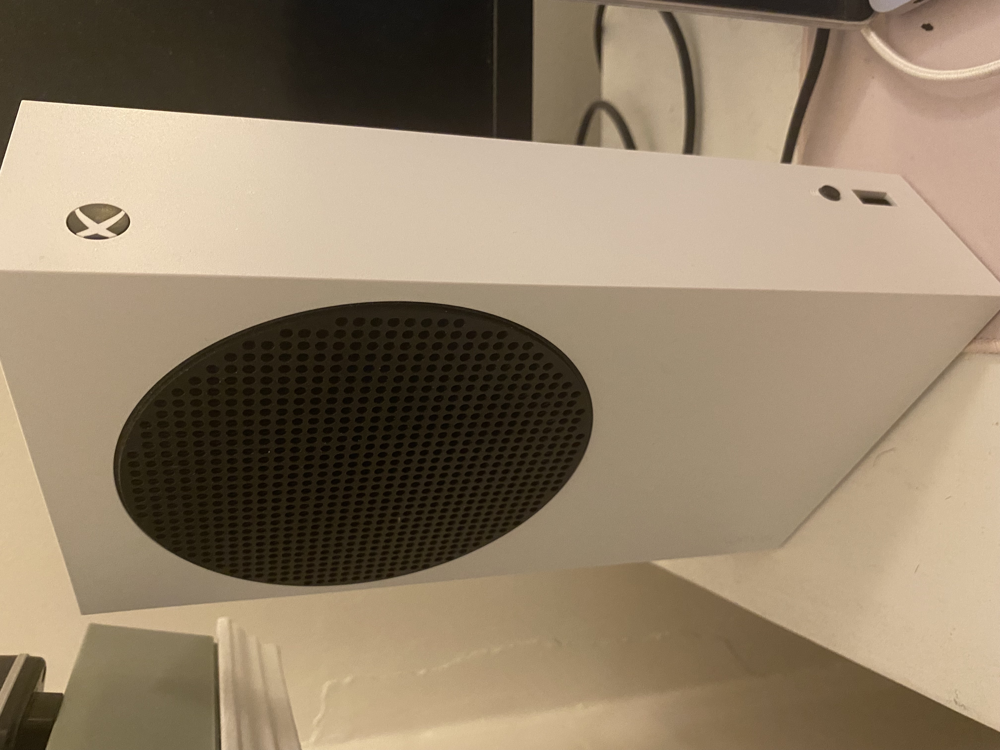 | Marston 自取 |
| LG 4k 显示器 | 50£0 | [查看](https://www.amazon.co.uk/dp/B07R9M25CT?ref=ppx_yo2ov_dt_b_fed_asin_title) | 无 | Science Area 自取 |
| KOORUI 165Hz, FHD 1080P 显示器 | 10£0 | [查看](https://www.amazon.co.uk/dp/B0B2RCXTK9?ref=ppx_yo2ov_dt_b_fed_asin_title&th=1) | 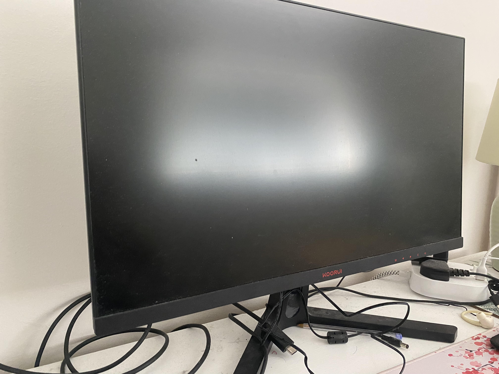 | Marston 自取 |
| 键盘 | 5£0 | [查看](https://www.amazon.co.uk/dp/B07YV7Y425?ref_=ppx_hzsearch_conn_dt_b_fed_asin_title_1&th=1) | 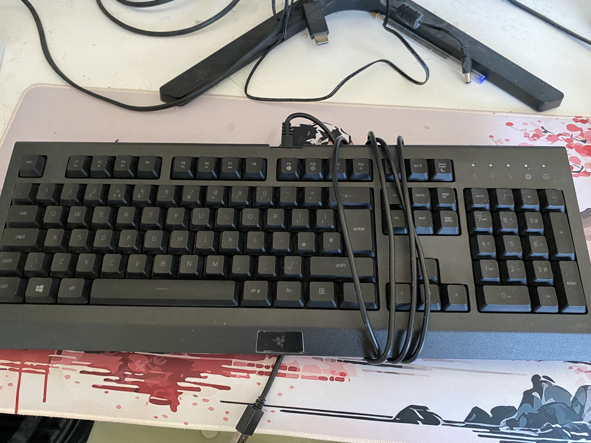 | Marston 自取 |
| Instant Pot 高压锅 | 0£0 | [查看](https://www.amazon.co.uk/dp/B00OP26T4K?ref=ppx_yo2ov_dt_b_fed_asin_title&th=1) | 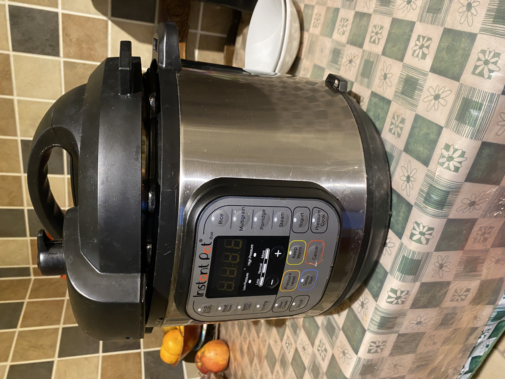 | Marston 自取 |
| 体重秤 | 0£0 | [查看](https://www.amazon.co.uk/dp/B071GYHSFX?ref=ppx_yo2ov_dt_b_fed_asin_title) | 无 | Marston 自取 |
| 小音箱 | 0£0 | [查看](https://www.amazon.co.uk/dp/B07VVP8BGD?ref=ppx_yo2ov_dt_b_fed_asin_title) | 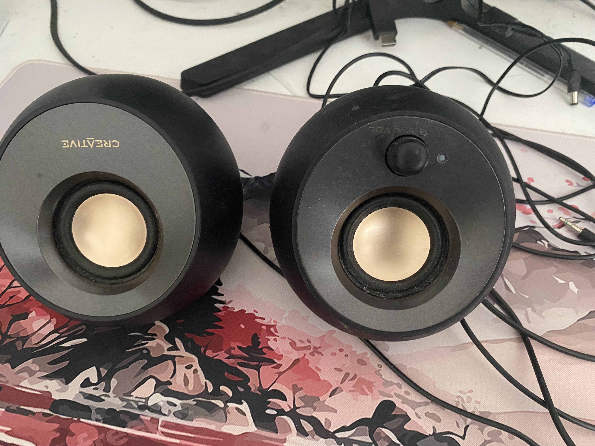 | Marston 自取 |
| 可充电小台灯 | 0£0 | 无 | 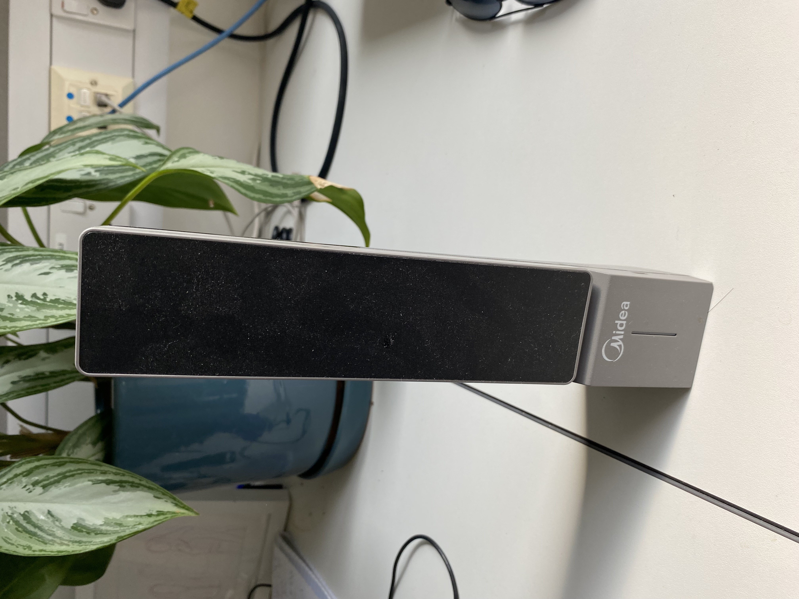 | Marston 自取 |
| 无线耳机 | 0£0 | 无 | 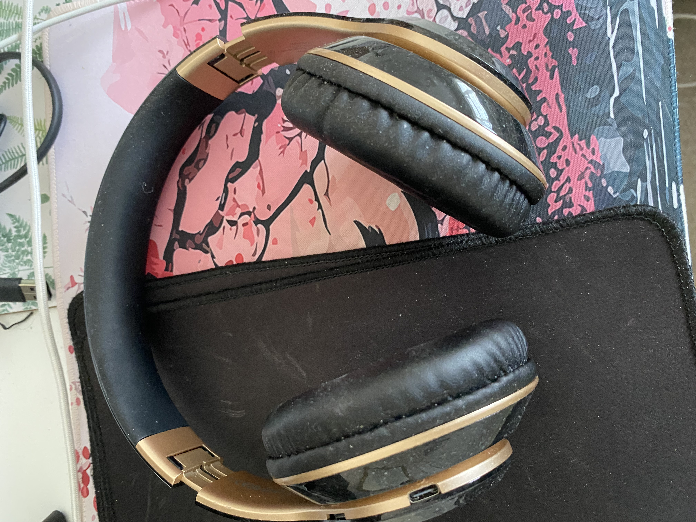 | Marston 自取 |

## 日用品

| 物品 | 价格 | 链接 | 图片 | 配送方式 |
| --- | --- | --- | --- | --- |
| 骑行头盔 | 0£0 | [查看](https://www.amazon.co.uk/dp/B085HP95Z2?ref=ppx_yo2ov_dt_b_fed_asin_title&th=1) | 无 | Marston or Science Area 自取 |
| 接线板 | 0£0 | [查看](https://www.amazon.co.uk/dp/B07ZGDK9L5?ref=ppx_yo2ov_dt_b_fed_asin_title&th=1) | 无 | Marston 自取 |
| 小汤锅(有盖) | 0£0 | [查看](https://www.amazon.co.uk/dp/B09DC7GD5C?ref=ppx_yo2ov_dt_b_fed_asin_title) | 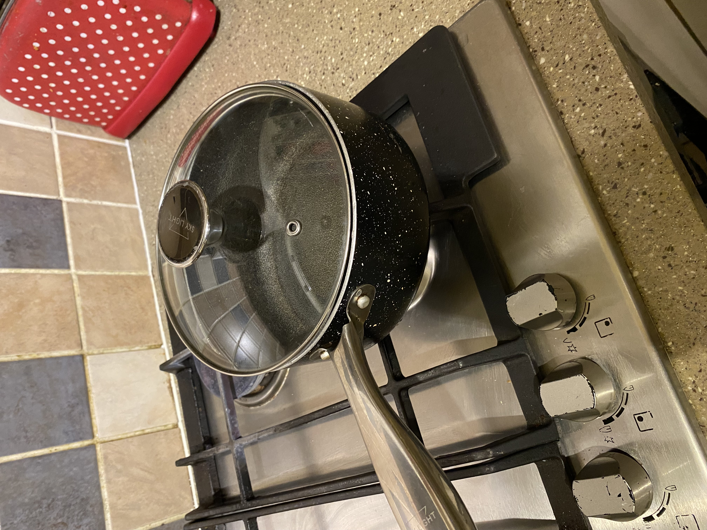 | Marston 自取 |
| 炒菜锅 | 0£0 | 无 | 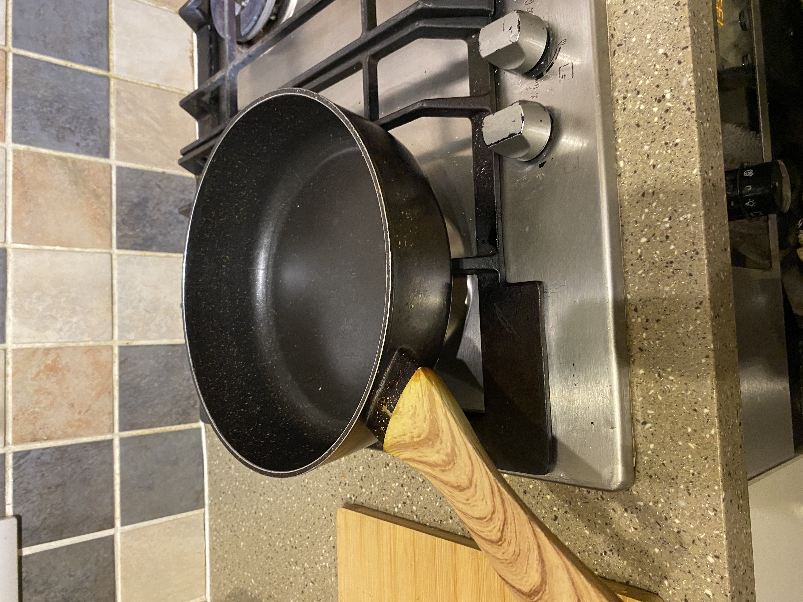 | Marston 自取 |
| 充电电池x4+充电器 | 0£0 | [查看](https://www.amazon.co.uk/dp/B00HZV9TGS?ref=ppx_yo2ov_dt_b_fed_asin_title&th=1) | 无 | Marston 自取 |
| HEAD Ti S6 Titanium 网球拍 + 网球12个 | 20£0 | [查看](https://www.amazon.co.uk/dp/B002KDM7EM?ref=ppx_yo2ov_dt_b_fed_asin_title&th=1) |  | Science Area 自取 |
| 壁球拍 + 壁球 2 个 | 10£0 | [查看](https://www.racketworld.co.uk/products/head-nano-ti-110-titanium-squash-racket) |  | Science Area 自取 |
| 小桌子 | 5£0 | [查看](https://www.racketworld.co.uk/products/head-nano-ti-110-titanium-squash-racket) | 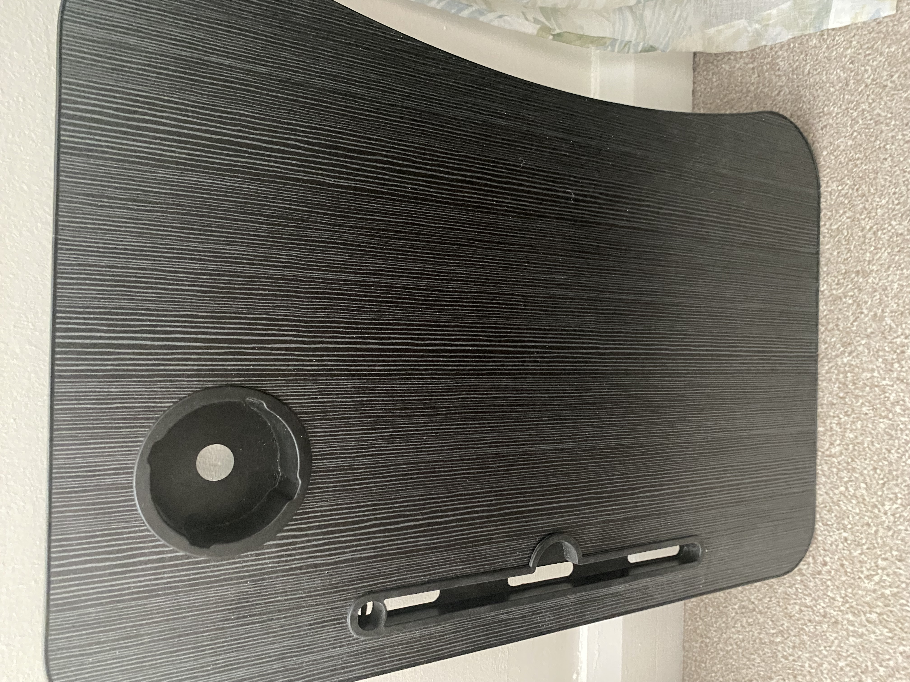 | Science Area 自取 |

## 书籍

| 物品 | 价格 | 链接 | 图片 | 配送方式 |
| --- | --- | --- | --- | --- |
| Stories of Hope | 00 | 无 | 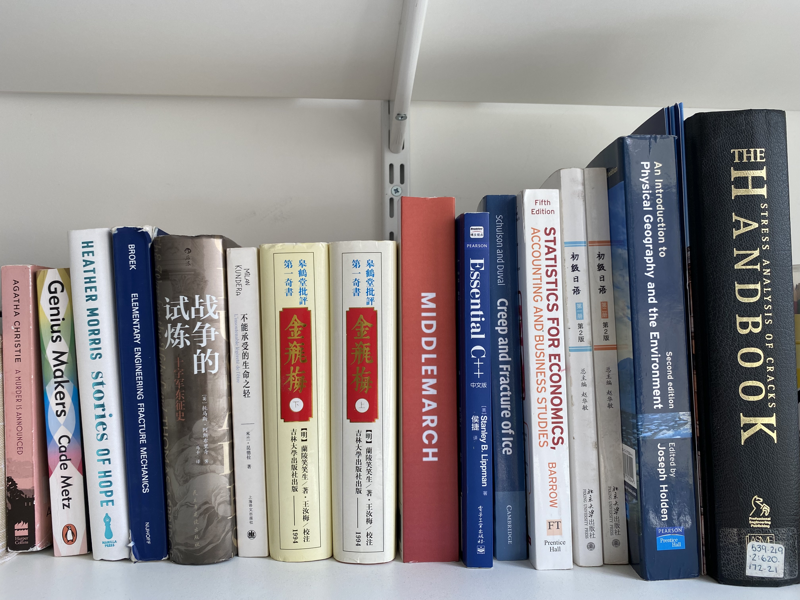 | Science Area 自取 |
| Elementary Engineering Fracture Mechanics | 00 | 无 | 无 | Science Area 自取 |
| 战争的试炼：十字军东征史 | 00 | 无 | 无 | Science Area 自取 |
| 不能承受的生命之轻 | 00 | 无 | 无 | Science Area 自取 |
| 金瓶梅（上） | 00 | 无 | 无 | Science Area 自取 |
| 金瓶梅（下） | 00 | 无 | 无 | Science Area 自取 |
| Middlemarch | 00 | 无 | 无 | Science Area 自取 |
| Essential C++ 中文版 | 00 | 无 | 无 | Science Area 自取 |
| Creep and Fracture of Ice | 00 | 无 | 无 | Science Area 自取 |
| Statistics for Economics, Accounting and Business Studies | 00 | 无 | 无 | Science Area 自取 |
| 初级日语 第一册 第2版 | 00 | 无 | 无 | Science Area 自取 |
| 初级日语 第二册 第2版 | 00 | 无 | 无 | Science Area 自取 |
| An Introduction to Physical Geography and the Environment | 00 | 无 | 无 | Science Area 自取 |
| The Stress Analysis of Cracks Handbook | 00 | 无 | 无 | Science Area 自取 |
